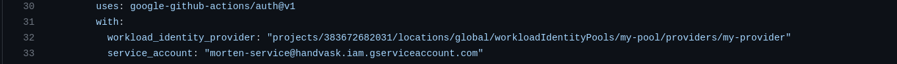

<h1 style="text-align: center;">Handvask minizinc - A microservice of the Handvask project</h1>


</img>

This project aims to create a system that can solve optimization
problems in the cloud. Users should be able to submit an optimization problem to
be solved, select one or more solvers to use to solve it in parallel and get the answer using the solver that returns a solution first.

## Website

The website can be found at [Handvask](https://handvask.tech).

# How to run the project

If you want to run the project locally, you will have to do the following:

1. First create .env files in the following directories:

   execute the local-run.sh script in the root directory of the project. This will create the .env files for you.
   This file should be provided in the hand-in or the discord channel.

```bash
chmod +x local_run.sh
./local_run.sh
```

if these are not created, the project will not run. Env for the cloud is much more sophisticated, I'll try to explain how to run the cloud version later.

## Backend

Starting the backend

The backend is a [FastAPI](https://fastapi.tiangolo.com/) application. To start it, run:

Stay in the handvask directory (the home directory for the repository) and run the following commands:

1. If .env is not created create a file called `~/python_backend/.env` and add the following content, The content of these files is secret, so you will have to ask someone to get them. They will either be provided in the hand-in or the discord channel:

   1. export DB_HOST="127.0.0.1"
   2. export DB_USER="username"
   3. export DB_PASS="password"
   4. export DB_NAME="database"
   5. export HANDVASK_FRONTEND_ORIGIN="\*"
   6. export MZN_API_KEY="1234"
   7. export MZN_MN_HOST="http://localhost:8383"

2. Run the following commands:

```bash
source /python_backend/.env
sudo apt install mysql-server
pip3 install -r requirements.txt
uvicorn python_backend.app.main:app --reload
```

3. [localhost_backend](http://localhost:8080/docs) here you can see the API documentation.

4. If you rather want to run the backend in a docker container, run the following commands:

```bash
cd python_backend
docker compose build
docker compose up
```

5. Running the backend in the cloud is already done, so you don't have to do anything. If you would like to Integrate a new version and deploy it, all you will have to do is make a change and push it to the GitHub main branch. GitHub workflow will then integrate and then deploy the new version to the cloud.

## Starting the frontend

The frontend is a [React](https://reactjs.org/) and [Next](https://nextjs.org/) application. To start it, run:

Go to the directory `/handvask_frontend` and run:

```bash
npm install
npm next build
npx next start
```

If it doesn't work, try npx next dev.
This will start the frontend on port 3000.

## Starting the minizinc.

First, you'll have to go into the directory /minizinc and run the following commands:

```bash
docker compose build
```

This will build the two images needed for the minizinc.
After that, you'll need to have minikube running. If you don't have minikube installed, you can find it here: [minikube](https://minikube.sigs.k8s.io/docs/start/).<br />
If minikube is not running, run the following command:

```bash
minikube start
```

After minikube has started, run the following command:

```bash
minikube load image handvask-minizinc-image &&
minikube load image handvask-minizinc-solver-image
```

These two commands make the images available to the minikube cluster.
If this is not done the deployment will not work.

You will need to change the image location in `minizinc/k8s/deployment.yaml`.

By default it will be `${ARTIFACT_LOCATION_MINIZINC}:${COMMIT_SHA}` due to how it works inside the github action workflow, but locally you will need to change it to the actual name of the image (`handvask-minizinc-solver-image`).

```bash
kubectl apply -f k8s/
&&
minikube tunnel
```

This will spawn the deployment, the clusterrole, clusterrolebinding, and the service.<br/>
Let the `minikube tunnel` run in the background, you might have to put in your password for it to be running.
Just wait for it to prompt the "enter your password" message.

# Demo

You can either go to the [Handvask](http://127.0.0.1:3000),
or you can go to the [FastAPI](http://localhost:8080/docs) to see the API documentation. Additionally, when running locally, [Minizinc-app](http://localhost:8383/docs) will also be available

## Deploy pipeline

The deploy pipeline is done using GitHub actions. The pipeline is triggered when a change is pushed to the main branch. The pipeline will then build the docker images for the backend and the frontend. It will then push the images to the docker hub. The pipeline will then deploy the images to the cloud.

The pipeline is split into four workflows

1. Pull-request

Whether a local branch change is done, the responsible person for the branch creates a pull request to the main branch. The pull request will then be reviewed by the responsible person for the main branch.
The pull request will also trigger the pipeline to run. It will build the docker images for which where changes were made.<br/>
If only changes were made in the handvask_frontend, the pipeline will catch this in:

```yaml
- name: Control if changes in handvask_frontend been made
  uses: dorny/paths-filter@v2
  id: changes
  with:
    filters: |
      backend:
        - 'handvask_frontend/**'
```

This is to ensure that we dont use unnecessary resources and make the pull request faster.
If the build doesn't fail, the pull request will be review by a member of the group and then merged to the main branch.

2. Integration

Next up whenever a pull-request is approved and merge into main branch, the integration workflow will run. This workflow will build the docker images for the frontend and the backend. It will then push the images to the docker hub. The images will then be deployed to the cloud.

The integration part have the same constraint just as above, if we dont see any changes in the handvask_frontend, the pipeline will not build the image for the frontend, but if we do see changes, it will build the image for the frontend.
The integration in yaml format is in the file .github/workflows/frontend_CI-CD.yml<br/>
The integration part is the second block of the image called frontend image build.


3. Deploy

The deploy workflow needs the CI part of the pipeline to finish. The deploy workflow will then deploy the images to the cloud. The deploy workflow is in the file .github/workflows/frontend_CI-CD.yml

## How to deploy the pipeline.

1. Google Account

You will need a google account to deploy the pipeline. You can create one here: [Google](https://accounts.google.com/signup/v2/webcreateaccount?flowName=GlifWebSignIn&flowEntry=SignUp)

2. Github Account

When you have create you brand new google account. You'll need to create a project in github, for this you'll need to go to the following link: [GitHub](github.com/new) and create a new repository.

3. Fork [Handvask](github.com/Handvask/handvask) the repository
4. Clone your forked repository to your local machine.
5. Go to the settings of the repository and go to the secrets tab.
6. Create the following secrets:
7. Create the database in cloud console.
   - Browse to SQL
   - Click "Create instance"
   - Select MySQL (currently the backend is hardcoded to expect mysql.)
   - Choose some instance name and password for the root user
   - Make sure to use the same region as everywhere else (e.g. `europe-north1`)
   - Once it's up, don't forget to create a database, and user account that can access said database.
   - Once you have a VPC created (step 14), don't forget to enable private networking for the database in edit -> connections -> private network, set the private network to the VPC.

```json
{
  "total_count": 15,
  "secrets": [
    {
      "name": "API_KEY",
      "description": "The API key used for communication between minizinc and the backend. We recommend a string of at least 32 characters, a good mix of lowercase, upper case and numbers should be sufficient."
    },
    {
      "name": "ARTIFACT_LOCATION_BACKEND",
      "description": "Artifacts location for Backend. Used for tagging, pushing, pulling and deploying images."
    },
    {
      "name": "ARTIFACT_LOCATION_FRONTEND",
      "description": "Artifacts location for Frontend. Used for tagging, pushing, pulling and deploying images."
    },
    {
      "name": "ARTIFACT_LOCATION_MINIZINC",
      "description": "Artifacts location for miniznc. Used for tagging, pushing, pulling and deploying images."
    },
    {
      "name": "ARTIFACT_LOCATION_MINIZINC_SOLVER",
      "description": "Artifacts location for Minizinc solver image. Used for tagging, pushing, pulling and deploying images."
    },
    {
      "name": "BACKEND_HOST",
      "description": "The hostname of the backend, used by the minizinc-app-service. Note that this value should end with /minizinc, e.g. if you're running the backend on localhost and the solver in a local kubernetes cluster, the HOST could be 'http://host.docker.internal:8080/minizinc'."
    },
    { "name": "DB_HOST", "description": "The hostname of the database." },
    { "name": "DB_NAME", "description": "The name of the database to use" },
    {
      "name": "DB_USER",
      "description": "THe username of an db user that can access the given database"
    },
    { "name": "DB_PASS", "description": "The password for the db user." },
    { "name": "GKE_CLUSTER_NAME", "description": "Cluster name in the GKE" },
    {
      "name": "GKE_PROJECT",
      "description": "The project name in the Google cloud"
    },
    { "name": "GKE_REGION", "description": "Region of deployment" },
    {
      "name": "GOOGLE_CREDENTIALS",
      "description": "Googe credentials which will help you run things from Github actions"
    },
    {
      "name": "NEXT_PUBLIC_API_URL",
      "description": "The URL of the API, used by the frontend."
    }
  ]
}
```

8. Create a service account in Google cloud.

9. Workpool.
   Follow the guide provided on the link [Workpool](https://github.com/google-github-actions/auth) to create a workpool for your service account to use for the github actions workflows

10. Change the workflow authentication so it works with your service accounts

You must now change all the workflow files so they match your service accounts and workflow pool.

This you must do for all three deployment files
`backend_CI-CD.yml`
`frontend_CI-CD.yml`
`minizinc_CI-cd.yml`

11. VPC Network in google cloud

For the application to work you'll to create your own VPC network and under the the cloud run you have to create a Serverless VPC access connector, and route only private request through the VPC.

12. Create Cloud Run.

Create a new cloud run in google cloud and import the enviroment variable the console


Once it's created, don't forget to go to edit and deploy revision -> connections, and add the cloud run to VPC network, as well as add a SQL connecetion to the datebase instance you set up earlier.

13. Create GKE cluster.

Go to the Kubernetes engine in the google cloud and create a cluster.
This is the name for the cluster which should be provided in the github workflow secrets `GKE_CLUSTER_NAME`

14. Integration and deploy

Make a slight change in all the directory:
handvask_frontend/
python_backend/
miniznc/

this will trigger the workflows and deploy the application

15.

## How does the application work overview?

The application is split into three parts, the frontend, the backend, and the minizinc.
The frontend is the part that the user interacts with. The backend is the part that handles the communication between the frontend and the minizinc.
The minizinc is the part that handles the solving of the optimization problems.

What happens when a user submits a problem to be solved?

1. The user submits the problem to the frontend.
2. The frontend sends the problem to the backend.
3. The backend sends the problem to the minizinc.
4. The minizinc starts a job with the specified problem and the solver sends from the backend,
   which the backend received from the frontend. It will start a job for every solver specified.
5. When a solver has found a solution, the minizinc sends the result back to the backend.
   Whether it is the optimal solution or not.
6. The frontend will then request updated information from the backend.

## How does the application work in detail?

<!-- // TODO -->
